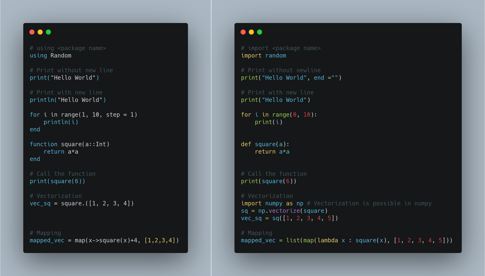

# Session 1  
**Date of session** : 16th January 2021  

Objectives of the session:
  1. Polynomial Curve fitting on a synthetically generated dataset.
  2. Automatic Differentiation
  3. Getting started with Julia  

**Session notebooks** : 
- **Julia** - [Curve Fitting using Automatic Differentiation](https://htmlpreview.github.io/?https://github.com/S4DS-IEM/Study-Group/blob/sess_1/Misc/Curve_Fitting.html)
- **Python** - [Curve Fitting using Numpy from scratch](https://nbviewer.jupyter.org/github/S4DS-IEM/Study-Group/blob/main/Study_Session_1/notebooks/CurveFitting.ipynb)
   

## Julia ⇌ Python
  

To get more such *conversion tables* you can see the [Quantecon Cheatsheet].(https://cheatsheets.quantecon.org)  
     

## Polynomial Curve fitting  
We have been following the book Pattern Recognition and Machine Learning by Chris Bishop. The first chapter of the book which introduces the mathematical concepts core to the book, begins with Curve fitting. Firstly, we created a non-linear dataset. Then, we tried to fit a polynomial to that dataset. We went through the following steps :
  1. Dataset Creation : We chose the sine function to create our dataset. For certain x values, its corresponding y value could be represented as the sum of the sine of x and a random number, which acts as noise in the dataset. The purpose of this noise is that most of the points of the dataset we have created don't lie on the curve y = sin(x) but sin(x) actually provides a very good approximation of the target function. So, basically, closer our obtained curve/function is to the sine curve, the better it is. 
  2. We have used a bit of linear algebra here. Say our target function is z. As we want to fit a polynomial(say of degree m), we will find z would look like  *z = w0+(w1 * x^1)+(w2 * x^2)+.....+(wm * x^m)*  . Now, we have to find a good approximation for w0 through wm. Let us denote this by a vector w.
  3. We have defined the loss function to be square loss or mean squared error. So, we have to now find a vector w for which, the loss function has least error. For this, we have used the *Gradient Descent Algorithm* . In brief, we calculate the gradients for the square loss with respect to the w vector and take a step in the direction of steepest descent by multiplying the gradient with the learning rate. 

The *Curve_Fitting.jl* file contains the code for the above steps. For best viewing, users have to have Julia and the Pluto package installed in their systems. Then they can clone the repository and copy the path of the file. In the Julia command line, the user has to type in *using Pluto; Pluto.run()* . Pluto will open up in the user's default browser. Then the user can paste the path in the Open a Notebook section and press open. The notebook will open up and then the user can play around with the code. 
